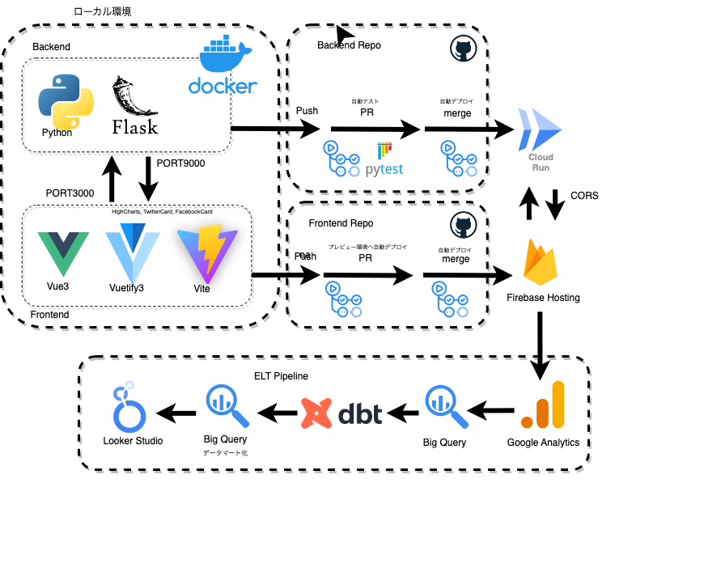

## asset-management-simulation-frontend

- 自作のWebAppである資産運用シミュレーションのフロントエンドに関するレポジトリです。
- バックエンドのレポジトリは [こちら](https://github.com/spider-man-tm/asset-management-simulation-backend)をご参照ください。



<br />

### Overview
- こちらのプロジェクトは[Vuetify3公式ドキュメント](https://vuetifyjs.com/en/getting-started/installation/)をベースに作成しています。
- 各グラフの描画にHighChartsを利用しています。
- Firebase Hosting へデプロイしています。
- develop branchへのPRがマージされたタイミングでmain branchへのリリースPRが自動で作成されます。
- GitHub上で main branch へPRがあった際に、GitHub Actionsを利用したfirebase hosting preview環境への自動デプロイが実施されます。
- mainブランチへpush、あるいはPRがマージされたタイミングでGitHub Actionsを利用した本番環境への自動デプロイが実施されます。

### Usage
- 環境変数の設定
  - プロジェクト直下に`.env.{hoge}.local`のようにファイルを用意します。
  ``` shell
  # 以下は例、本番用の.envはGitHubActionsを使った自動デプロイを想定しているためここでは定義していない
  .
  ├── .env.development.local
  └── .env.staging.local
  ```
  - 以下のような形で環境変数`VITE_BACKEND_URL`、および`VITE_GTAG_ID`を定義します
  ``` shell
  # .env.development.local
  VITE_BACKEND_URL = http://127.0.0.1:9000
  VITE_GTAG_ID = G-XXXXXXXXXX
  ```
  ``` shell
  # .env.production.local (ステージング環境でのBACKENDエンドポイント)
  VITE_BACKEND_URL = https://hoge-fuga.run.app
  VITE_GTAG_ID = G-XXXXXXXXXX
  ```
  - `package.json`を編集します
  ``` json
  "scripts": {
    // Viteで開発用サーバーを起動する際は.env.development.localがデフォルトでloadされる
    "dev": "vite",
    // Viteでビルドする際は.env.productionがデフォルトでloadされる
    "build": "vite build",
    // もしstagingなどの.envを使い分ける際は以下の様に--modeオプションでコマンドを追加していく
    "buildstg": "vite build --mode staging",
    "preview": "vite preview"
  },
  ```
  - （以下、補足）
    - GitHub Actionsを利用した自動デプロイでは.gitignoreされた.env.**.localファイルを使用することはできません
    - そこでビルド環境上で.envファイルを直接作成してしまうことにしています（`firebase-hosting-pull-request.yaml`参照）

-  Project setup
  - 必要なパッケージをインストールします
```
# yarn
yarn

# npm（自分はこちらを使用しています）
npm install

# pnpm
pnpm install
```

- Compiles and hot-reloads for development
  - Viteを`--mode local`で動かします
```
# yarn
yarn dev

# npm（自分はこちらを使用しています）
npm run dev

# pnpm
pnpm dev
```

- Compiles and minifies for production
```
# yarn
yarn build

# npm（自分はこちらを使用しています）
npm run build

# pnpm
pnpm build
```

- Customize configuration

See [Configuration Reference](https://vitejs.dev/config/).

<br />

## Deployment

### GitHub Actions
- このレポジトリをクローンし、自身のレポジトリとして改めてpush作成します。
- Firebaseプロジェクトを作成
  - backend側でGoogle Cloud Runを使用するのでそちらを同じGCPプロジェクトに紐づく形で作成
- Firebase アプリを新規作成（Webアプリを選択）
- Firebase SDKをインストール
``` shell
npm install firebase
```
- Firebase CLIをインストール
``` shell
npm install -g firebase-tools
```
- Firebaseへログイン
``` shell
firebase login
```
- firebaseプロジェクトとして初期化
``` shell
firebase init
```

```
# 以下、インタラクティブで進めていく

? Which Firebase features do you want to set up for this directory? Press Spac
e to select features, then Enter to confirm your choices. (Press <space> to se
lect, <a> to toggle all, <i> to invert selection, and <enter> to proceed)

# こちらを選択（Space押して選択後にEnterで決定）
Hosting: Configure files for Firebase Hosting and (optionally) set up GitHub Action deploys

=== Project Setup

First, let's associate this project directory with a Firebase project.
You can create multiple project aliases by running firebase use --add,
but for now we'll just set up a default project.

# こちらを選択
Use an existing project

? Select a default Firebase project for this directory: (Use arrow keys)

# 先ほど作成したFirebaseプロジェクトを選択

=== Hosting Setup

Your public directory is the folder (relative to your project directory) that
will contain Hosting assets to be uploaded with firebase deploy. If you
have a build process for your assets, use your build's output directory.

? What do you want to use as your public directory? (public)

# Vueの場合、ビルドしたファイルはdistディレクトリに生成されるのこちらを入力

? Configure as a single-page app (rewrite all urls to /index.html)? (y/N)

# Yesを選択することで全てのページがindex.htmlを経由する（＝ home以外をリロードしても404にならない）
# 今回はSPAを作っているのでYesを選択

Set up automatic builds and deploys with GitHub? (y/N)

? For which GitHub repository would you like to set up a GitHub workflow? (for
mat: user/repository)

# 自身のレポジトリを選択
# GitHub Actionsの設定 & Firebase連携に必要な環境変数やkeyなどの設定を自動でやってくれます。

? Set up the workflow to run a build script before every deploy? (y/N)

# Yesを選択

? What script should be run before every deploy?

# とりあえず今回はnpmで管理しているので以下を入力
# npm ci && npm run build

? Set up automatic deployment to your site's live channel when a PR is merged?

# Yesを選択

? What is the name of the GitHub branch associated with your site's live chann
el?

# mainを入力、masterブランチで管理してる場合はそちらを入力

✔  Firebase initialization complete!
```

- ビルド環境上で.envファイルを作成できるよう`.github/`以下の各YAMLを修正（内容はコードを参照）
- GitHubレポジトリで以下のSecret（環境変数）を追加
  - `VITE_BACKEND_URL`
  - `VITE_GTAG_ID`
- GitHubレポジトリで Settings → Actions → General を選択し、`Read and write permission`ラジオボタンをチェック、その後、`Allow GitHub Actions to create and approve pull requests`を選択し、保存する
  - これを実施しないと、mainブランチへのマージによる自動デプロイは成功するものの、PRを起点としたpreview環境へのデプロイが失敗してしまう
